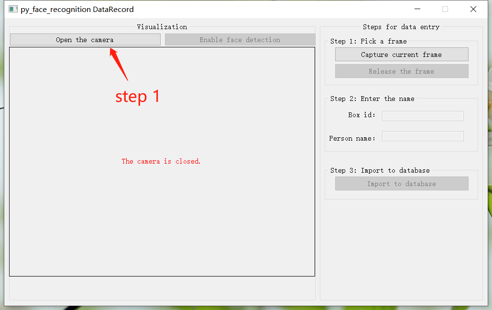
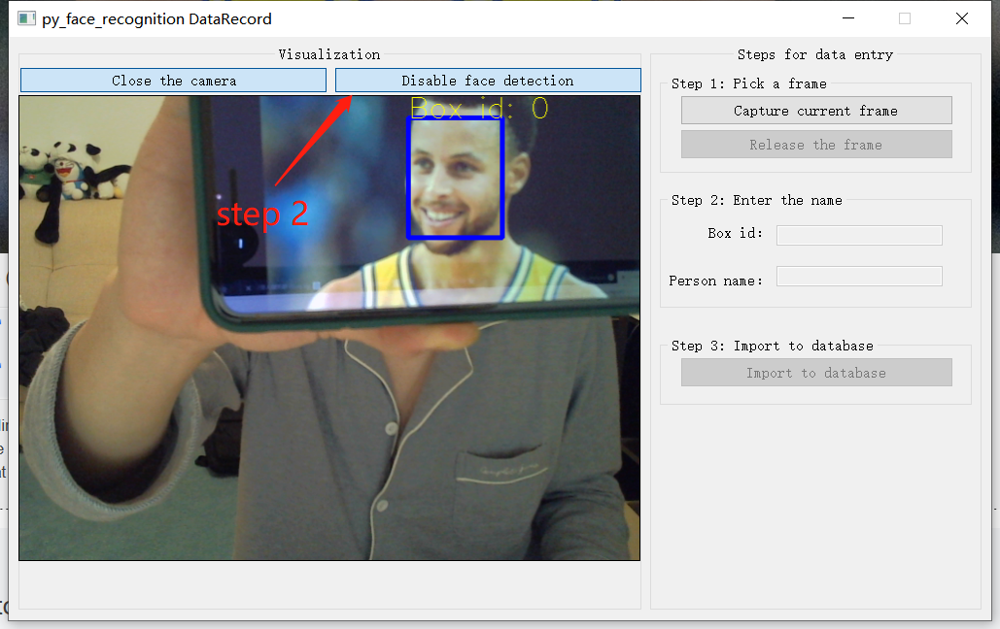
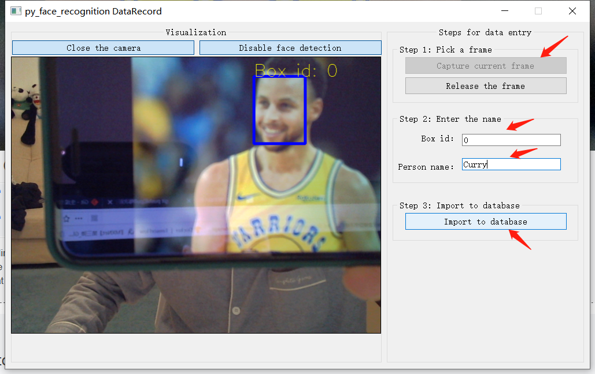
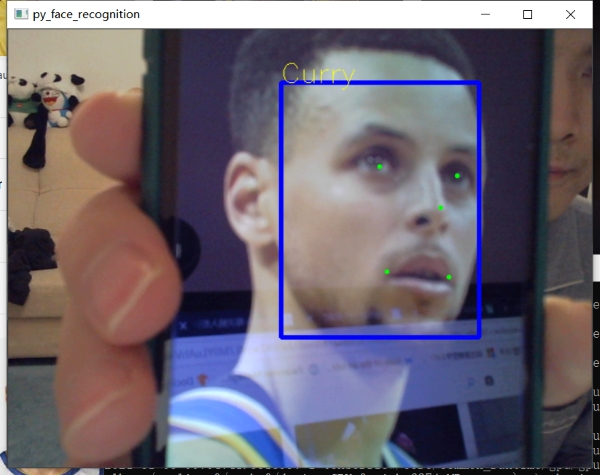

# A pure python face recognition system #
## Introduction ## 
This repo contructs a simple face recognition system based on the famous [MTCNN](https://kpzhang93.github.io/MTCNN_face_detection_alignment/)
and [ArcFace](https://arxiv.org/pdf/1801.07698.pdf) model.
The system consists of two parts, i.e., a **database management interface** and a **real-time face recognition program**.


## Dependencies ##
- Python 3.6+   
- TensorFlow 1.12.0 (TF 1.x or TF 2.x should also works)
- PyQt5==5.9.2
- scikit-image==0.16.2
- opencv-python


## Get started ##
Clone the project
```
git clone https://github.com/huangh12/py_face_recognition.git
```

### Add your face to database ###
Simply run
```Python
python create_database.py
```

It will open a graphical interface.
Try to add your target face into database as follows        

Open the camera



Enable face detection      



Capture the frame when you feel the face quality is fine. Also, you can release the frame and re-capture until the desired frame is obtained.

Enter the information according to the detection results and import to
database finally.




### Run the face recognition program ###
Simply run
```Python
python run.py
```

It will open your webcam and execute real-time face recognition.
Let's take the other Stephen Curry image for testing.

BINGO!




## End ##
Have fun with the project, and please star it if you like it.       
Thank you.